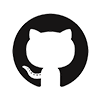

### Hi there 👋, I'm Bibek Gurung

I am a Software developer, living in London. Front-end development is my specialty but I'm also open to full-stack development 🚀.

My expertise lie in, but not limited to,  **JavaScript/TypeScript** and **React/React Native** with **Redux**. I have also gained experience in Express, Mongo and Mongoose for the back-end side of programming. My knowledge in Adobe Photoshop, Illustrator and After Effects nicely rounds up my design skills and compliments my front-end development skills 😎.

When I am not programming, I find myself enjoying activities like Basketball🏀, Swimming🏊‍♀️, Animation🏃‍♀️🏃‍♂️ and Video Editing📽 to name a few.

<code></code>
<code></code>
<code></code>
<code></code>
<code></code>
<code></code>
<code></code>
<code></code>
<code></code>
<code></code>
<code></code>
<code></code>
<code></code>

<!--
**bibekgurunguh/bibekgurunguh** is a ✨ _special_ ✨ repository because its `README.md` (this file) appears on your GitHub profile.

Here are some ideas to get you started:

- 🔭 I’m currently working on ...
- 🌱 I’m currently learning ...
- 👯 I’m looking to collaborate on ...
- 🤔 I’m looking for help with ...
- 💬 Ask me about ...
- 📫 How to reach me: ...
- 😄 Pronouns: ...
- ⚡ Fun fact: ...
-->
